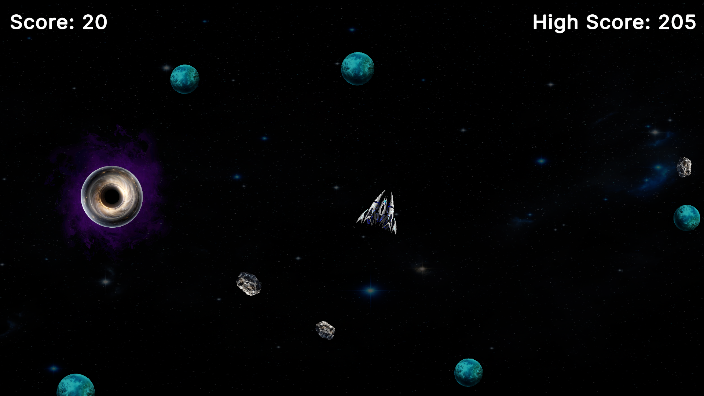
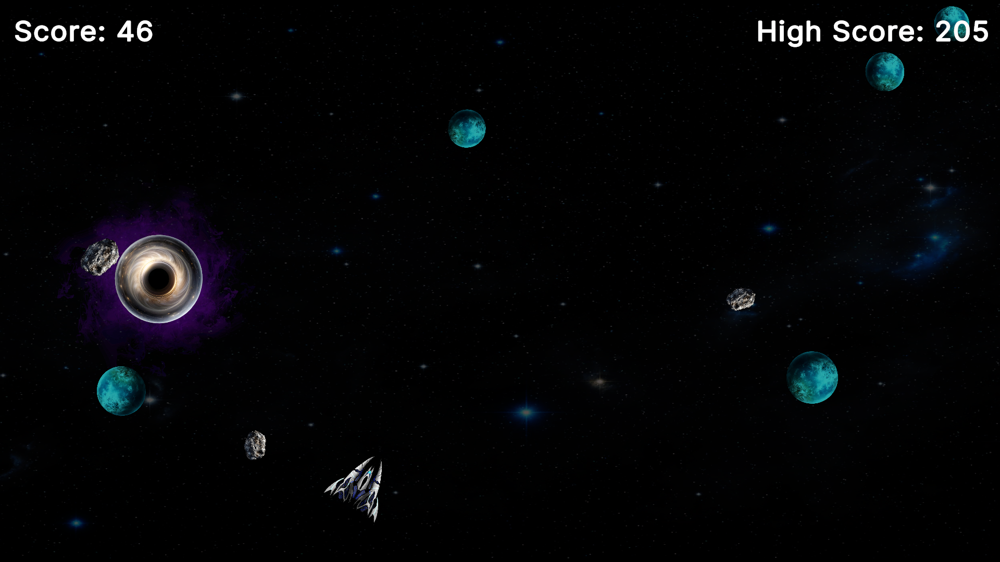
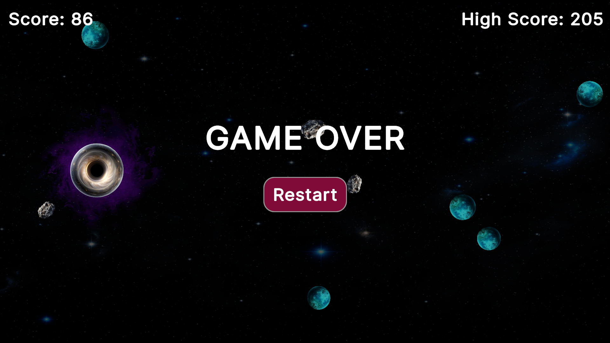

# Space Dodger

### Game Overview
Space Dodger is a 2D arcade survival game where players control a spaceship and navigate through a dangerous space zone filled with planets, meteors, and a powerful black hole.

The objective is simple: survive as long as possible, avoid obstacles, overcome the black hole's gravitational pull, and achieve the highest score.

The game focuses on quick reactions, smooth movement, and challenging survival gameplay.

---

### Genre
Arcade / Survival

---

### Platform
PC(Windows) and Android

---

### Developed with 
Unity

## Features
- Mouse and touch-based spaceship controls
- Endless survival gameplay
- Dynamic planets and meteor obstacles
- Black hole with a gravity mechanic
- High score system using PlayerPrefs
- Particle effects and sound effects
- Explosion and game-over effects

---

## Controls
| Action | Input |
|--------|-------|
| Move Spaceship | Hold Left Mouse Button / Touch Screen |
| Aim Direction | Mouse Cursor / Finger Position |

---

## Assets & Resources
- Unity built-in tools and particle systems
- Sound effects from Pixabay (used under its license)
- Third-party sprites used for educational and portfolio pirposes

---

## Gameplay Video
The complete source code, assets, and project files are available in this repository.

---

## Gameplay Video

---

## Screenshots

### Gameplay

### Gameplay 2

### Game Over Screen

---

## Author
Tashmi

